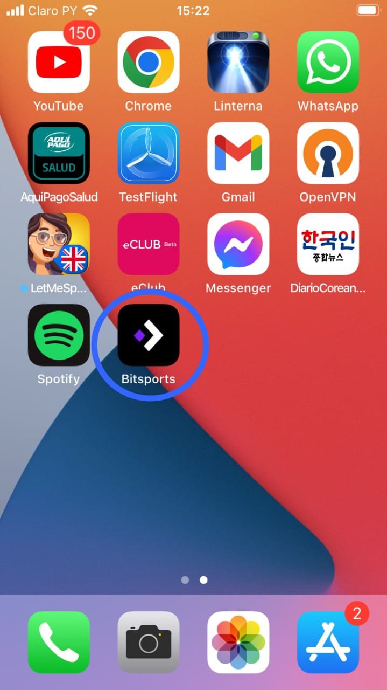
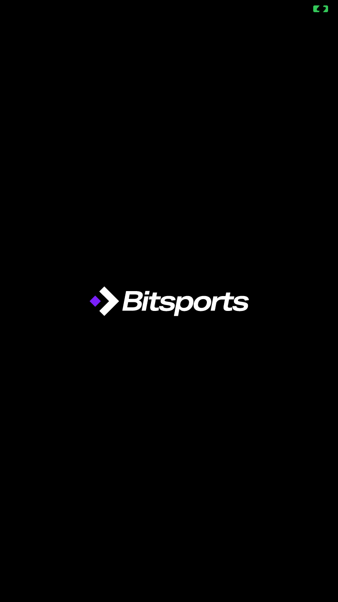
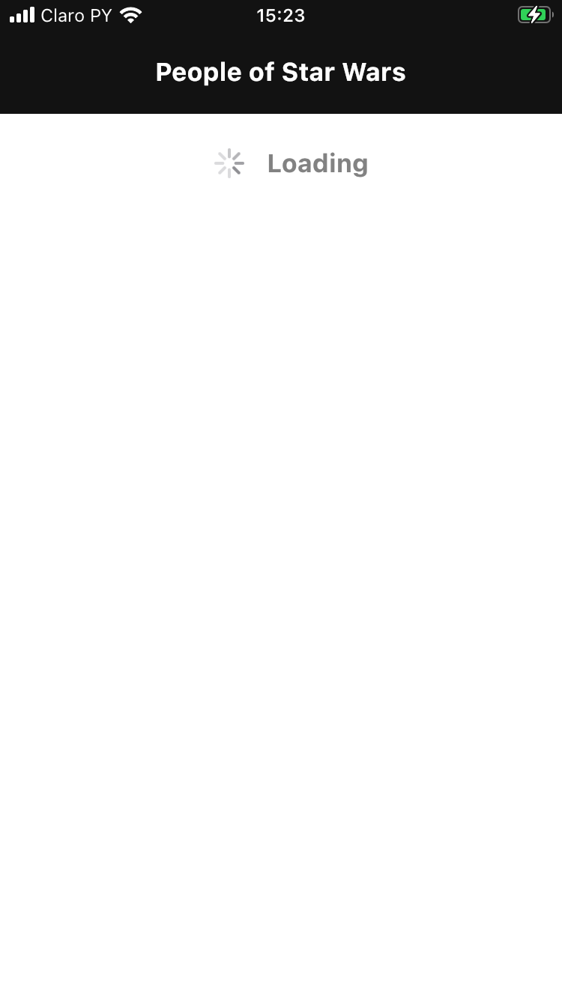
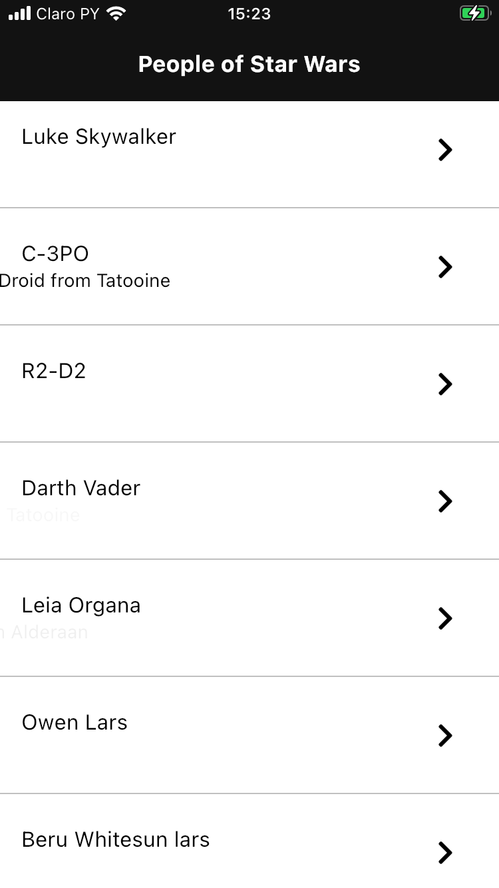
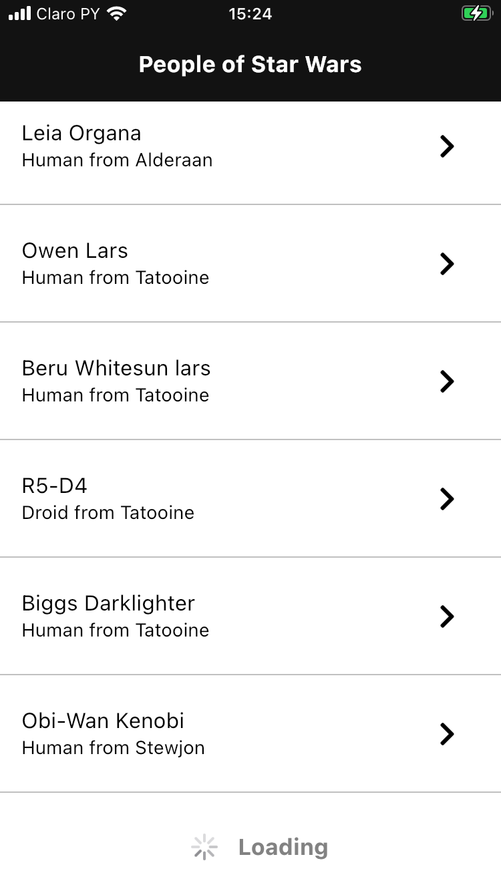

# Bitsports Challenge

## Descipción
Para el presente challenge utilice el paquete de gestión de estados provider (también tengo conocimientos con Cubit, Bloc, GetX) pero que me pareció adecuado provider debido a que el proyecto es pequeño. 
Utilice la librería animated_do para dar dinamismo a la carga de contenido, al iniciar se muestra la información que ya se obtiene en el método principal y se va animando la información adicional ya que el método principal no devuelve dicha información.
También agregue los tests unitarios los cuales estaban como opcionales pero me parece que es un ítem importante en cualquier aplicación que busca automatizar los procesos de test.
El challenge no requeria, pero me pareció apropiado agregar un splash screen nativo para iOS y android, así como el icono de la aplicación
<table>
    <tr>
        <td></td>
        <td></td>
        <td></td>
    </tr>
    <tr>
        <td></td>
                <td></td>
        <td>&nbsp</td>
    </tr>
</table>

## Paquetes Utilizados

### Paquete de gestor de estado utilizado
#### provider: ^6.0.2 https://pub.dev/packages/provider 

### Paquete para crear el launch icon en todas las versiones de pantalla
#### flutter_launcher_icons: ^0.9.2 https://pub.dev/packages/flutter_launcher_icons

### Paquete para la conectividad
#### http: ^0.13.4 https://pub.dev/packages/http

### Iconos
#### awesome_icons: ^1.1.0 https://pub.dev/packages/awesome_icons

### Animaciones
#### animate_do: ^2.1.0 https://pub.dev/packages/animate_do

### Paquetes para test unitarios
#### dartz: ^0.10.1 https://pub.dev/packages/dartz
##### Permite programación funcional

#### equatable: ^2.0.3 https://pub.dev/packages/equatable
##### Permite la comparación de objetos de una manera simple agregando una función al modelo

#### mockito: ^5.0.16 https://pub.dev/packages/mockito
##### Permite emular clientes http

